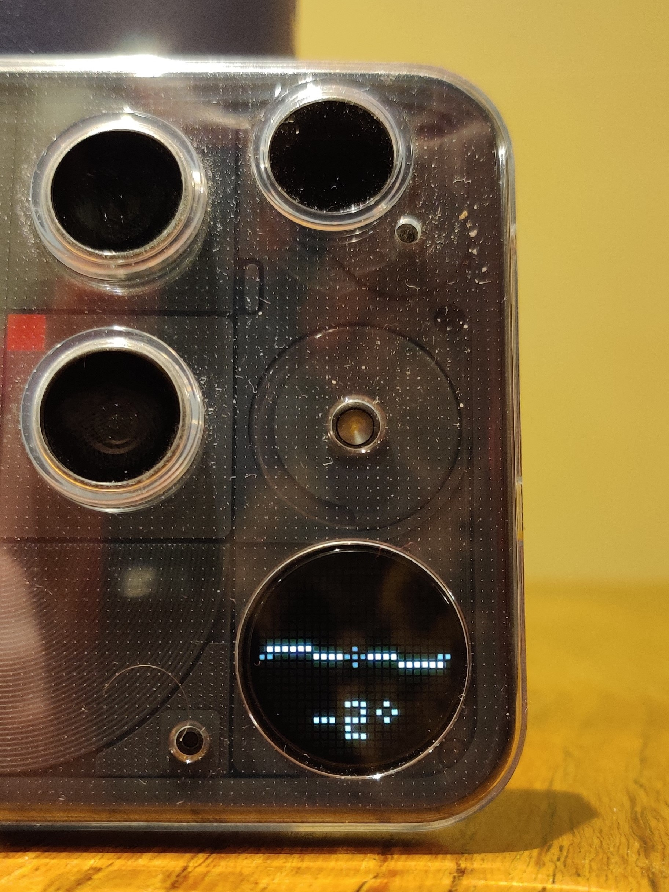
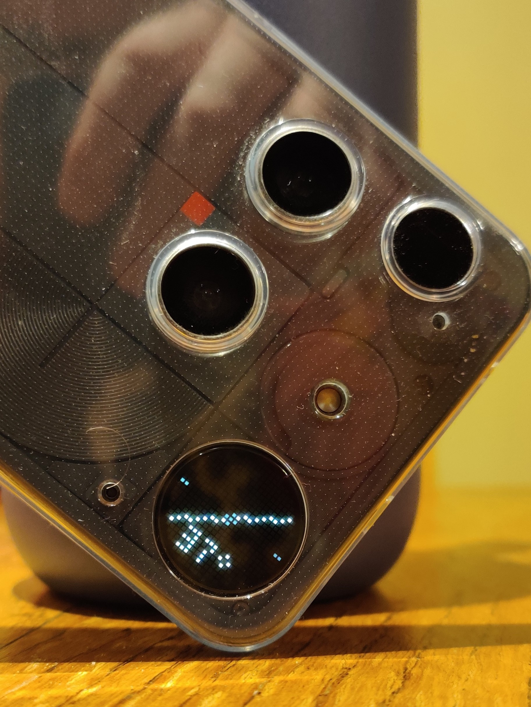

# Mayeo's GlyphMatrix Toys
Some toys to be used with the GlyphMatrix on the Nothing Phone 3. All still heavily beta, being worked on in my spare time.

This is the source code only, there is no final "app" yet. The repo must be cloned and opened in Android Studio, then built onto a Nothing Phone 3.

Bit of tidying up needed but the first three GlyphToys are working.

All these Toys use a custom 3x5 font to fit a bit more info onto the screen, allowing a bit more flexibility with things.

# Current Toys

## Angle Finder
Find the angle of a tilted surface by placing the phone on its edge (with the volume buttons on the table).

GlyphMatrix will show the angle, and a line matching the horizontal.

## REST API
Display info collected from a REST API.

In the Main app, you set the REST API endpoint (web address) and press "Fetch". The app will display a flattened list of all the available fields, where you can select the ones you want to be displayed.

On the Glyph Toy itself, it will display one of the fields plus its value at a time. The field name will scroll across the screen, and the value remain static (this was built to display temperatures, will add some smarts to scroll the values if they are wider than the screen).

You can cycle through the fields by using the Long Press functionality of the Glyph button.

## Now Playing
Show the song title and artist for the currently playing song.

Text will scroll across the GlyphMatrix screen, and the first letter of the app that's playing the music will show at the top.

Might try to add a symbol/icon instead? Maybe faded over the whole screen?

This supports the AOD functionality, though song/title updating might be delayed slightly.

# Other things

## DrawUtils

A utility object (that may be useful to others) that helps draw to the screen:
- Static, scrolling, and rotated text (using 3x5 characters)
- Line drawing
- Shape drawing (currently rectangle)
- More to be added

# References
Some help from the sample Toys in the [GlyphMatrix Developer Kit](https://github.com/Nothing-Developer-Programme/GlyphMatrix-Developer-Kit/tree/main), and a little ChatGPT
